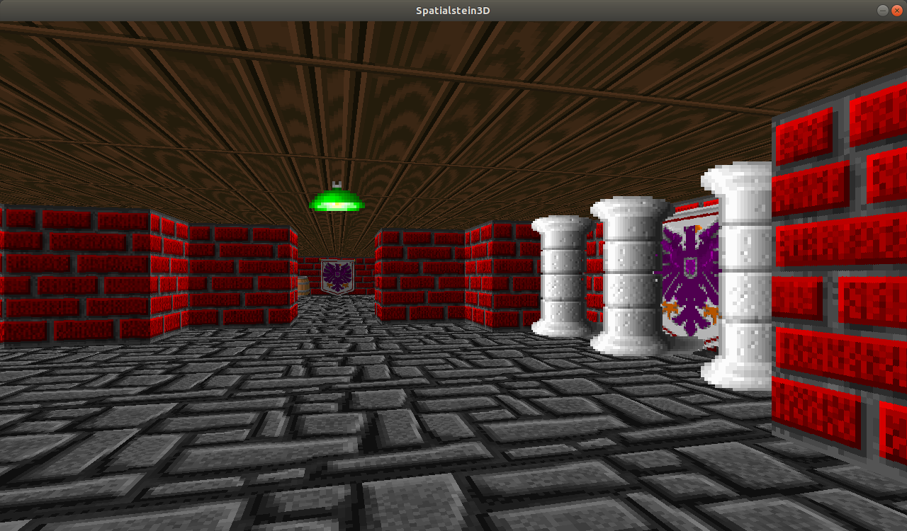

# Chapter 1 - Basic project setup
## Code branch

https://github.com/improbable-andreaskrugersen/spatialstein3d/tree/chapter1-base-project

## Goals

At the end of this chapter we have a simple FPS game where you can just run around a map. It will not be a SpatialOS project yet and won't have any networked features. In fact, it doesn't have any noteworthy features at all but it serves as a foundation for the subsequent chapters.

## Content
The basis for our project is a software-rendered FPS raytracer based on [Lode's Raycasting Tutorial](https://lodev.org/cgtutor/raycasting.html). On closer inspection you will find that it has pretty much the same content as the tutorial but organized in a more maintainable way.

Since we're not going to use a game engine, we have to do all the rendering ourselves (which isn't that much at all with a software renderer). Also, we're making use of the [Eigen](http://eigen.tuxfamily.org/index.php?title=Main_Page) math library for vector and matrix calculations which is kept in the `dependencies/eigen` folder.

In contrast to later chapters, this first chapter doesn't contain any explicit tutorials but just presents the code as-is to get started. The details of the raytracer are not important to understand how a SpatialOS project works and the other code parts will be discussed later when adding networked features.

That being said, here's a short overview of what the project contains so far:

- WorldMap ([client/src/worldmap.hpp](https://github.com/improbable-andreaskrugersen/spatialstein3d/blob/chapter1-base-project/client/src/worldmap.hpp))

  This represents our world and is (at this stage) a simple 24 x 24 grid. Each cell consists of an integer that determines if the cell is free (`0`) or should have a wall (`> 0`). If there is a wall, the number represents a 1-based texture index of all the textures loaded into the renderer, so `1` is the first texture (texture index `0`) etc.

- Player ([client/src/player.hpp](https://github.com/improbable-andreaskrugersen/spatialstein3d/blob/chapter1-base-project/client/src/player.hpp))

  A very simple player representation. We don't have any weapons or stats yet, just a position and a direction.

- Camera ([client/src/camera.hpp](https://github.com/improbable-andreaskrugersen/spatialstein3d/blob/chapter1-base-project/client/src/camera.hpp))

  An equally simple camera representation. In a raycaster, we just need a 2D vector representing our camera plane (which is always perpendicular to the player direction). Refer to [Lode's Raycasting Tutorial](https://lodev.org/cgtutor/raycasting.html) for more information.

- RayCasterRenderer ([client/src/renderer.hpp](https://github.com/improbable-andreaskrugersen/spatialstein3d/blob/chapter1-base-project/client/src/renderer.hpp))

  The actual renderer. No further explanation is given here, please refer to [Lode's Raycasting Tutorial](https://lodev.org/cgtutor/raycasting.html) for details on how this works.

  One thing to note is that you can add additional textures to the renderer using `RayCasterRenderer::addTexture()`. There is currently a simple validation between texture indices in `WorldMap` and available textures which will just take the first texture in the list if the index doesn't exist.

- Assets are kept in the `assets` folder

## Controls

Move the player with `W`,`A`,`S`,`D` or the cursor keys.

## Building

Open a terminal in the project folder and run

`bazel build //client/src:spatialstein3d -c opt`

Note that we're building an optimized version here (`-c opt`). If you build an unoptimized version (which is the default) or a debug version (`-c dbg`), the game is way too slow to actually play.

## Running

### Ubuntu 18.04

`bazel-bin/client/src/spatialstein3d`

### Windows

`bazel-bin/client/src/spatialstein3d.exe`
